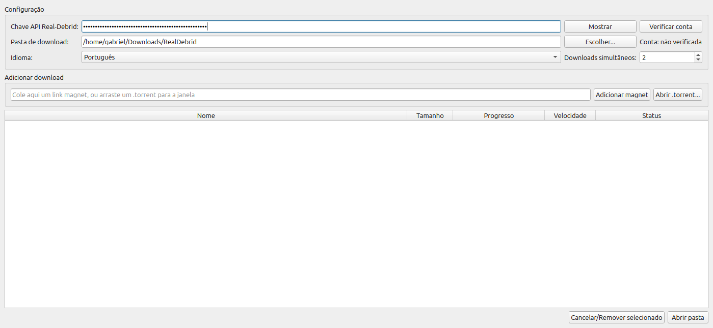

<h1 align="center">🧲 RDDownloader</h1>

<p align="center">
  <b>Baixe torrents e magnets pela sua conta Real-Debrid — sem abrir o site.</b><br>
  <i>Download torrents and magnets through your Real-Debrid account — without opening the website.</i>
</p>

<p align="center">
  
  
  
  
  
</p>

<p align="center">
  
</p>

---

## ⬇️ Download (pronto para usar / ready to run)

Não quer instalar Python? Baixe o executável na página de
**[Releases](../../releases)**:

- 🪟 **Windows** — `RDDownloader-windows.exe` (dê dois cliques)
- 🐧 **Linux** — `RDDownloader-linux` (`chmod +x` e execute)

> No Windows, o SmartScreen pode avisar por ser um app novo sem assinatura —
> clique em *Mais informações → Executar assim mesmo*.

---

## 🇧🇷 Português

Cole um link **magnet** ou abra um arquivo **.torrent**. O programa envia para o
Real-Debrid (que baixa nos servidores deles), pega os links diretos e baixa os
arquivos para a pasta que você escolher — com barra de progresso e velocidade.

### ✨ Recursos

- 🧲 Suporte a **magnet** e arquivos **.torrent**
- 🖱️ **Arraste e solte** o .torrent (ou um magnet) direto na janela
- 🌍 **Multi-idioma**: Português, English, Español (troca em tempo real)
- 📊 Barra de progresso, tamanho e velocidade por download
- ⚡ Vários downloads **simultâneos** (configurável)
- 🔔 **Notificação** quando um download termina
- 💾 Chave API e preferências salvas — configure só uma vez
- 🔒 Tudo roda **localmente**; sua chave nunca sai do seu computador

### 🚀 Como usar

1. Pegue sua chave em **https://real-debrid.com/apitoken**
2. Instale as dependências e rode:
   ```bash
   pip install -r requirements.txt
   python3 rddownloader.py
   ```
   (ou dê dois cliques em `iniciar.sh`)
3. Cole a **Chave API**, clique em **Verificar conta** e escolha a **pasta**.
4. Cole um **magnet** (ou arraste um `.torrent`) e pronto.

> A barra vai de **0–50%** enquanto o Real-Debrid prepara o arquivo e de
> **50–100%** durante o download para o seu computador.

---

## 🇺🇸 English

Paste a **magnet** link or open a **.torrent** file. The app sends it to
Real-Debrid (which downloads it on their servers), grabs the direct links and
downloads the files to the folder you pick — with progress bar and speed.

### Features

- 🧲 **Magnet** and **.torrent** support
- 🖱️ **Drag & drop** a .torrent (or magnet) onto the window
- 🌍 **Multi-language**: English, Português, Español (live switching)
- 📊 Per-download progress, size and speed
- ⚡ Configurable **simultaneous** downloads
- 🔔 **Notification** when a download finishes
- 💾 API key and preferences saved locally

### Quick start

```bash
pip install -r requirements.txt
python3 rddownloader.py
```

Get your API key at **https://real-debrid.com/apitoken**, paste it, verify the
account, choose a folder, then paste a magnet or open a `.torrent`.

---

## 📦 Requisitos / Requirements

- Python 3.8+
- [PyQt5](https://pypi.org/project/PyQt5/) e [requests](https://pypi.org/project/requests/)
  ```bash
  pip install -r requirements.txt
  ```
- Uma conta **Real-Debrid premium** / A **premium Real-Debrid** account

## 🌍 Adicionar um idioma / Add a language

É fácil! Veja [`CONTRIBUTING.md`](CONTRIBUTING.md). Resumindo: copie um bloco em
[`translations.py`](translations.py), traduza os valores (não as chaves) e abra
um Pull Request. O novo idioma aparece sozinho no seletor.

## 🔐 Privacidade / Privacy

A chave API e as configurações ficam só no seu computador, em
`~/.config/rddownloader/config.json`. O programa fala **apenas** com a API
oficial do Real-Debrid.

## ⚖️ Aviso / Disclaimer

Ferramenta para uso pessoal com sua própria conta Real-Debrid. Baixe apenas
conteúdo que você tem o direito de acessar. / Personal-use tool for your own
Real-Debrid account. Only download content you are allowed to access.

## 📄 Licença / License

[MIT](LICENSE)
