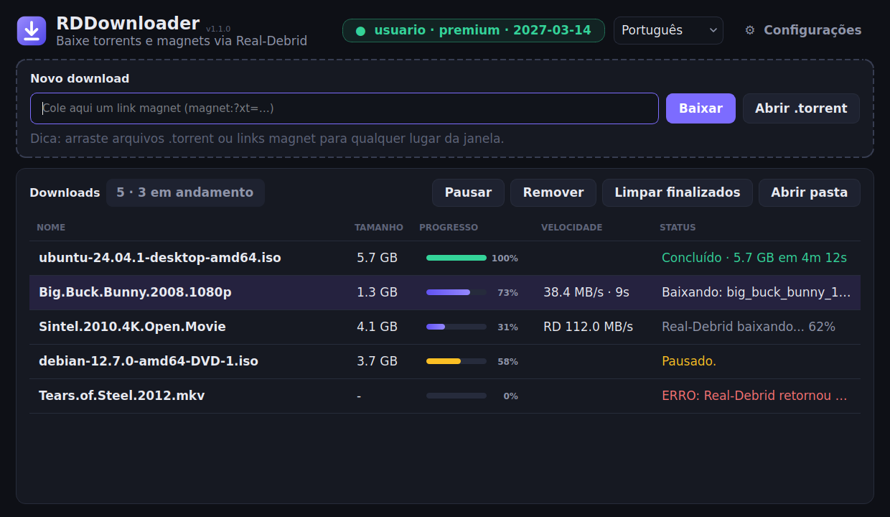

<p align="center">
  
</p>

<h1 align="center">RDDownloader</h1>

<p align="center">
  <b>Baixe torrents e magnets pela sua conta Real-Debrid — sem abrir o site.</b><br>
  <i>Download torrents and magnets through your Real-Debrid account — without opening the website.</i>
</p>

<p align="center">
  <a href="../../releases/latest"></a>
  
  
  
</p>

<p align="center">
  
</p>

---

## ⬇️ Baixar — nada para instalar

| Sistema | Download | Como abrir |
|---|---|---|
| 🪟 **Windows 10/11** | [**RDDownloader-windows.exe**](https://github.com/GabrielCatarini/RDDownloader/releases/latest/download/RDDownloader-windows.exe) | Dois cliques. Pronto. |
| 🐧 **Linux** | [**RDDownloader-linux**](https://github.com/GabrielCatarini/RDDownloader/releases/latest/download/RDDownloader-linux) | Botão direito → *Propriedades* → *Permitir executar*, depois dois cliques (ou `chmod +x RDDownloader-linux`). |

Funciona num PC recém-formatado: o executável já traz tudo dentro (Python, Qt
e bibliotecas). Não precisa instalar Python nem nada.

> **Windows mostrou "O Windows protegeu o computador"?** É o SmartScreen avisando
> que o app é novo e não tem assinatura paga. Clique em **Mais informações →
> Executar assim mesmo**. O código é aberto e o `.exe` é compilado
> automaticamente pelo GitHub Actions a partir deste repositório.

## 🚀 Primeiro uso (1 minuto)

1. Entre na sua conta e copie sua chave em **https://real-debrid.com/apitoken**
2. Abra o RDDownloader, cole a chave e clique em **Salvar e verificar**
3. Cole um link **magnet** e clique em **Baixar** — ou arraste um `.torrent` para a janela

Os arquivos vão para `Downloads/RealDebrid` (dá para trocar em **Configurações**).

## ✨ Recursos

- 🧲 **Magnet** e arquivos **.torrent** (vários de uma vez)
- 🖱️ **Arraste e solte** `.torrent` ou magnet em qualquer lugar da janela
- 📋 Copiou um magnet? Ao voltar para a janela ele já aparece pronto para baixar
- 📊 Progresso, **velocidade real e tempo restante** de cada download
- ⏸️ **Pausar / retomar** (continua de onde parou) e **tentar novamente** em caso de erro
- 🔁 Recupera sozinho de quedas de internet
- ⚡ Vários downloads **simultâneos** (configurável)
- ✅ Verifica a conta automaticamente e mostra até quando seu premium vale
- 🔔 Notificação quando um download termina
- 🌍 Português, English, Español (troca na hora)
- 🌙 Interface escura moderna

> A barra vai de **0–50%** enquanto o Real-Debrid prepara o arquivo nos
> servidores dele e de **50–100%** durante o download para o seu computador.

---

## 🇺🇸 English

**Download:** [Windows (.exe)](https://github.com/GabrielCatarini/RDDownloader/releases/latest/download/RDDownloader-windows.exe) ·
[Linux](https://github.com/GabrielCatarini/RDDownloader/releases/latest/download/RDDownloader-linux) —
self-contained, nothing to install. Double-click and go.

1. Get your API key at **https://real-debrid.com/apitoken**
2. Paste it in RDDownloader and click **Save & verify**
3. Paste a **magnet** link and click **Download** — or drop a `.torrent` onto the window

Features: magnets and .torrent files, drag & drop, real-time speed and ETA,
pause/resume with byte-level resume, automatic retry on network drops,
simultaneous downloads, account status, notifications, PT/EN/ES UI.

On Windows, SmartScreen may warn because the app is new and unsigned: click
*More info → Run anyway*. The `.exe` is built by GitHub Actions from this repo.

---

## 🧑‍💻 Rodar pelo código-fonte / Run from source

Dê dois cliques em **`iniciar.bat`** (Windows) ou rode **`./iniciar.sh`**
(Linux/macOS). Na primeira vez ele prepara tudo sozinho: no Windows instala o
Python via `winget` se precisar, cria um ambiente isolado em `.venv` e
instala as dependências.

Manual:

```bash
python3 -m venv .venv
.venv/bin/pip install -r requirements.txt      # Windows: .venv\Scripts\pip
.venv/bin/python rddownloader.py
```

Testes:

```bash
QT_QPA_PLATFORM=offscreen python3 -m unittest discover -s tests -t .
```

Para publicar uma nova versão, crie uma tag `vX.Y.Z` e envie (`git push --tags`):
o GitHub Actions testa, compila os executáveis e cria o Release.

## 🔐 Privacidade / Privacy

Sua chave API e as preferências ficam **só no seu computador**, em
`~/.config/rddownloader/config.json` (no Windows: `C:\Users\<você>\.config\rddownloader`),
com permissão apenas para o seu usuário. O programa fala **apenas** com a API
oficial do Real-Debrid. Sem telemetria.

Your API key stays on your computer only. The app talks exclusively to the
official Real-Debrid API. No telemetry.

## 🌍 Traduções / Translations

Quer o RDDownloader no seu idioma? Veja [`CONTRIBUTING.md`](CONTRIBUTING.md):
basta copiar um bloco de [`translations.py`](translations.py) e traduzir.

## ⚖️ Aviso / Disclaimer

Ferramenta para uso pessoal com sua própria conta Real-Debrid. Baixe apenas
conteúdo que você tem o direito de acessar. Este projeto não é afiliado ao
Real-Debrid. / Personal-use tool for your own Real-Debrid account. Only
download content you are allowed to access. Not affiliated with Real-Debrid.

## 📄 Licença / License

[MIT](LICENSE)
